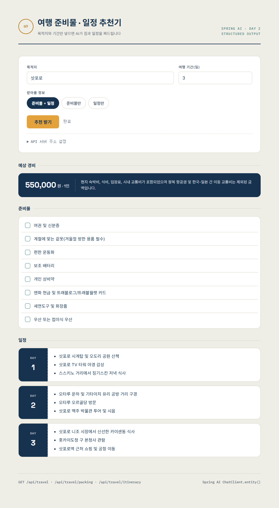

# day02-prompt-output

Spring AI Day 2 — Prompt / Structured Output 실습 프로젝트.
AI 응답을 String이 아니라 Java 타입으로 받는 방법을 익히기 위해
`PromptTemplate`(입력)과 `.entity()`(출력) 두 가지를 중심으로 구성했다.

## 무엇이 담겨 있나

| 구분 | 목적 | 핵심 기술 |
|---|---|---|
| 준비물 목록 API | 단순 문자열 목록 응답 | `.entity(new ListOutputConverter(...))` |
| 여행 준비물+일정 API | 위 세 방식의 응용, 중첩 record | `.entity(Class)` + `List<record>` 필드 |

## 프로젝트 구조

```
src/main/java/com/study/day02promptoutput/
├── Day02PromptOutputApplication.java
├── TravelController.java           # /api/travel, /api/travel/packing, /api/travel/itinerary
├── TravelService.java              # 응용 프로젝트 — 여행 준비물+일정 추천기
└── dto/
    ├── DayPlan.java                # record(day, activities)
    └── TravelPlanResponse.java     # record(packingList, itinerary, estimatedBudgetKrw, budgetNote) — 중첩 record

src/main/resources/
├── application.yml                 # API Key는 환경변수로만 관리
└── static/
    └── index.html                  # 여행 추천기 프론트엔드
```

## 실행 방법

1. 환경변수에 Gemini API Key 설정
   ```
   export GOOGLE_API_KEY=발급받은키
   ```
2. `./gradlew bootRun` 또는 IDE에서 `Day02PromptOutputApplication` 실행
3. 브라우저에서 `http://localhost:8080` 접속 → 여행 추천기 웹 화면 확인

`index.html`을 `src/main/resources/static/`에 두면 Spring Boot가 정적 리소스로 서빙하기 때문에
프론트엔드와 API가 같은 오리진에서 동작해 별도 CORS 설정이 필요 없다.
파일을 다른 위치에서 직접 열어서 쓰는 경우, `TravelController`에 `@CrossOrigin`을 추가하거나
화면의 "API 서버 주소 설정"에서 Base URL을 지정해야 한다.

## 엔드포인트 목록

| 메서드 | 경로 | 설명 | 응답 타입 |
|---|---|---|---|
| GET | `/api/packing?destination=&days=` | 준비물 목록 (분류기 버전) | `List<String>` |
| GET | `/api/travel/packing?destination=&days=` | 준비물 목록 | `List<String>` |
| GET | `/api/travel/itinerary?destination=&days=` | 일별 일정 | `List<DayPlan>` |
| GET | `/api/travel?destination=&days=` | 준비물 + 일정 한 번에 | `TravelPlanResponse` |

## 응답 캡처

<!--
아래 자리에 스크린샷을 넣으세요.
1) 캡처 이미지를 프로젝트 폴더(예: docs/images/)에 저장
2) 아래처럼 마크다운 이미지 문법으로 삽입
   
-->

### 여행 준비물 · 일정 추천기



## 오늘 배운 것 요약

**입력 — PromptTemplate**
문자열을 이어 붙이지 않고, `{변수}` 자리를 가진 템플릿에 `.param()`으로 값을 바인딩한다.
SQL의 `?` 바인딩과 같은 발상. 모든 호출에 공통인 규칙은 `defaultSystem()`에,
특정 기능에만 해당하는 규칙은 해당 메서드의 user 템플릿에 둔다.

**출력 — 부탁에서 계약으로**
자연어로 "JSON으로 답해줘"라고 하는 것은 부탁이다. 모델 응답은 확률적이라
형식이 흔들리거나(`**priority**:` 같은 마크다운) 값 자체가 어긋날 수 있다(`"높음"` vs `"HIGH"`).
`StructuredOutputConverter`(`.entity()`)를 쓰면 record의 필드에서 JSON 스키마를 만들어
검증된 형식 지시문을 자동으로 삽입하고, 응답을 파싱해서 타입으로 돌려준다. 부탁을 계약으로 바꾸는 장치다.

**세 가지 받는 방법**

| 받고 싶은 것 | 쓰는 것 |
|---|---|
| 객체 한 건 | `.entity(MyRecord.class)` |
| 객체 여러 건 | `.entity(new ParameterizedTypeReference<List<T>>() {})` |
| 문자열 목록 | `.entity(new ListOutputConverter(...))` |

`TravelPlanResponse`처럼 record 안에 `List<record>`를 중첩하면, 이 세 가지 중
"객체 한 건" 방식만으로도 준비물 목록과 일정 리스트를 한 번에 받아올 수 있다.

**그래도 100%는 아니다**
`.entity()`도 내부는 "지시 + 파싱"이라서 모델이 스키마를 어기면 변환 예외가 날 수 있다.
실무에서는 try-catch, 재시도, 폴백을 준비하고, 잘 안 바뀌어야 하는 값은
프롬프트와 record 양쪽에 명시해두는 습관이 필요하다.

## 체크리스트

- [x] 응용 — 여행 준비물 + 일정 추천기 (`TravelPlanResponse`, 중첩 record)
- [x] 심화 — `estimatedBudgetKrw`, `budgetNote` 필드 추가 (record 확장 → 스키마 자동 확장 체감)
- [x] 프론트엔드 — `index.html`로 세 엔드포인트 테스트 가능한 화면 구성

## 다음 (Day3) 미해결 질문

- 로깅·공통 규칙을 모든 호출에 끼우려면? → **Advisor**, `.call()` 앞뒤에 개입하는 인터셉터
- 모델은 직전 대화를 기억하지 못한다 → **Chat Memory**, 애플리케이션이 맥락을 넣어주는 구조
