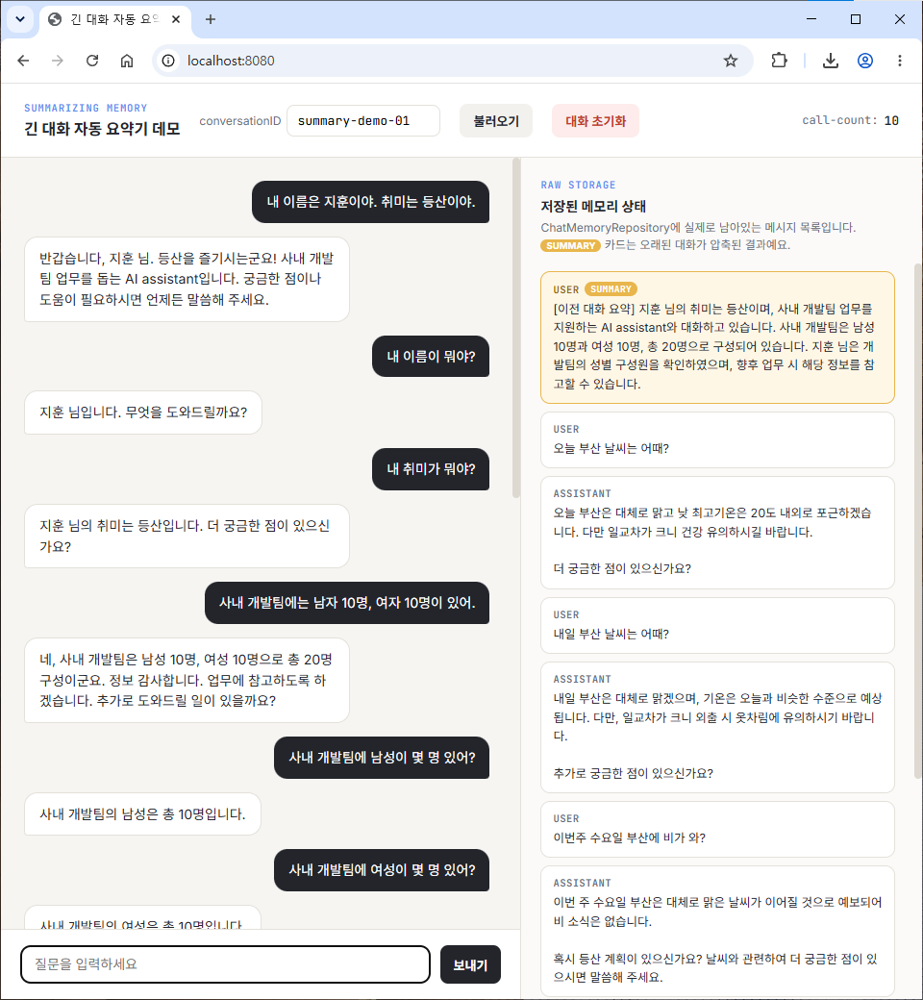

# day03-advisor-memory

Spring AI Day 3 — Advisor / Memory 실습 프로젝트.
대화의 맥락을 유지하기 위한 `ChatMemory`와 호출 흐름에 개입하는 `Advisor`를 학습하고, 
긴 대화 시 컨텍스트 오버플로우를 방지하는 **'요약형 메모리 체계'**를 구현했다.

## 무엇이 담겨 있나

| 구분 | 목적 | 핵심 기술 |
|---|---|---|
| 자동 요약 메모리 | 대화가 길어지면 이전 대화를 요약본 하나로 압축 | `ChatMemory`, `ConversationSummarizer` |
| 인터셉터 기능 | LLM 호출 횟수 및 동작을 전역적으로 감시/기록 | `CallCounterAdvisor`, `AroundAdvisor` |

## 프로젝트 구조

```
src/main/java/com/study/day03advisormemory/
├── SummarizingMemoryApplication.java   # 메인 클래스
├── ChatMemoryConfig.java               # ChatMemory 빈 등록 및 설정
├── ConversationSummarizer.java         # 요약 전담 LLM 호출 컴포넌트
├── SummarizingChatMemory.java          # 핵심 — 요약형 ChatMemory 구현체
├── SummaryChatService.java             # 대화 서비스 (메모리 조회/초기화 캡슐화)
├── AiController.java                  # REST 엔드포인트 (/api/chat-summary, /api/call-count)
├── advisor/
│   └── CallCounterAdvisor.java         # 호출 횟수 카운터 Advisor
└── dto/
└── MemoryMessageView.java          # 메모리 상태 시각화용 응답 DTO

src/main/resources/
├── application.yml                     # 로깅 및 API Key 환경변수 관리
└── static/
└── index.html                      # 실시간 메모리 모니터링이 가능한 채팅 UI
```

## 실행 방법

1. 환경변수에 Gemini API Key 설정
   ```bash
   export GOOGLE_API_KEY=발급받은키
    ```

2. `./gradlew bootRun` 또는 IDE에서 `SummarizingMemoryApplication` 실행
3. 브라우저에서 `http://localhost:8080/index.html` 접속 → 채팅 및 실시간 메모리 상태 확인

`index.html` 화면 우측 패널에서 `chatMemory.get(conversationID)`의 저장 상태를 실시간으로 시각화하여, DB나 세션을 뜯어보지 않고도 메모리 압축 과정을 눈으로 파악할 수 있다.

## 엔드포인트 목록

| 메서드 | 경로 | 설명 | 응답 타입 |
| --- | --- | --- | --- |
| GET | `/api/chat-summary?question=&conversationID=` | 요약형 메모리가 적용된 챗봇 질의 | `String` |
| GET | `/api/chat-summary/history?conversationID=` | 현재 메모리에 남아있는 메시지 목록 조회 | `List<MemoryMessageView>` |
| GET | `/api/chat-summary/clear?conversationID=` | 특정 세션의 대화 기억 초기화 | `String` |
| GET | `/api/call-count` | `CallCounterAdvisor`에 누적된 LLM 호출 횟수 | `Long` |

## 응답 캡처

### 긴 대화 자동 요약 챗봇



## 오늘 배운 것 요약

**맥락 유지 — ChatMemory**
LLM은 본질적으로 직전 대화를 기억하지 못하는 무상태(Stateless) 구조다. 개발자가 이전 대화 내역(`History`)을 매 요청마다 프롬프트에 쑤셔 넣어주어야 비로소 '기억하는 척'을 한다. Spring AI는 이 역할을 `ChatMemory` 추상화 인터페이스와 `Advisor`를 통해 우아하게 자동화한다.

**긴 대화의 딜레마와 요약(Summarization)**
대화가 무한히 길어지면 컨텍스트 토큰 제한(Token Limit)을 초과하거나 비용이 폭발한다. 이를 해결하기 위해 일정 턴(Turn) 이상 지나간 과거 대화는 삭제하되, 삭제하기 전 핵심 내용을 **또 다른 LLM 호출을 통해 하나의 '요약본 메시지'로 압축**하여 메모리 최상단에 고정하는 전략을 구현했다.

**트러블슈팅 기록: 모델 특성 파악의 중요성**

* **Gemini의 500 에러 사건:** 요약본을 대화 내역에 `SystemMessage`로 끼워 넣었더니 Gemini API에서 500 에러를 뱉었다. Gemini는 대화 턴(`contents`) 도중에 `system` 역할이 섞이는 것을 허용하지 않고, 오직 최상위 `systemInstruction`으로만 시스템 메시지를 받기 때문이었다.
* **해결책:** 요약 메시지를 `UserMessage` 타입으로 위장하여 저장하고, 프런트엔드와 백엔드에서 특정 접두어(`[이전 대화 요약]`)로 판별하도록 우회 수정하여 해결했다.
* **데이터 페어 정합성:** 과거 대화를 잘라낼 때(`cutIndex`) 홀수 개로 자르면 유저와 AI의 대화 쌍(Pair)이 깨질 수 있으므로, 항상 짝수로 내림 보정하는 디테일이 필요하다.

**비용과 지연 시간의 트레이드오프**
질문 1번당 **[본 응답 호출 1번 + 요약 트리거 시 요약 호출 1번]** 구조로 최대 2번의 LLM 호출이 일어난다. 실무에서는 요약 주기를 넉넉히 잡거나, 요약 전담에는 비용이 저렴하고 빠른 경량 모델(예: Flash 계열)을 별도로 매핑하는 전략이 유리하다.

## 체크리스트

* [x] 구현 — 일정 턴 이상 대화 시 자동으로 과거 내역을 압축하는 `SummarizingChatMemory`
* [x] 해결 — Gemini API 스펙에 맞춘 요약 메시지 `UserMessage` 우회 처리 및 페어 보정
* [x] 모니터링 — `AroundAdvisor` 기반의 `CallCounterAdvisor`로 전역 LLM 호출 횟수 추적
* [x] 시각화 — 메모리에 남은 실제 메시지와 `SUMMARY` 카드를 주황색으로 강조하는 모니터링 화면 구성

## 다음 (Day 4) 미해결 질문

* 사용자가 준 도큐먼트(PDF, TXT) 내용을 기반으로 똑똑하게 답변하게 만드려면? → **RAG (Retrieval-Augmented Generation)**
* 텍스트 데이터를 LLM이 이해할 수 있는 숫자로 바꾸고 저장하는 방법은? → **Embedding** & **Vector Database**

### 주요 변경 및 보완 포인트
* **구조적 정렬:** 기존에 줄글과 나열식으로 되어 있던 '알려진 한계 / 트러블슈팅' 내용과 '관찰 포인트'를 제공해주신 양식의 **[오늘 배운 것 요약]** 항목으로 자연스럽게 녹여냈습니다.
* **비교 테이블 활용:** 무엇이 담겨 있나 파트에 핵심 기술을 표로 깔끔하게 정리했습니다.
* **다음 미해결 질문 연결:** Day 2 문서의 마지막 부분처럼, Day 3(Memory/Advisor)에서 자연스럽게 Day 4(RAG, Embedding) 주제로 넘어갈 수 있도록 빌드업하는 질문을 하단에 추가했습니다.
